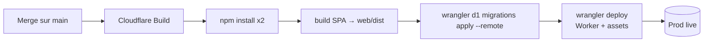

# Déploiement — GIT VM Portal (OpenStack)

> Comment le projet est **construit, migré et publié**. Lis [`CONFIGURATION.md`](CONFIGURATION.md)
> pour les variables/secrets. Dernière mise à jour : 2026-06-23.

---

## 1. TL;DR — comment livrer

1. Travaille sur une **branche**, ouvre une **PR**, fais passer la CI (typecheck/lint/test/build).
2. **Merge sur `main`**.
3. **Cloudflare Workers Builds** prend le relais automatiquement : build → migrations D1 → déploiement.
4. Vérifie en live : `curl https://git-vm-portal-openstack.thomas-prudhomme.workers.dev/api/presets`.

> ❌ **Ne lance pas `wrangler deploy` à la main** en fonctionnement normal : Cloudflare le fait.
> (Exception : le **tout premier** déploiement a été fait manuellement pour créer le Worker.)

## 2. Deux pipelines distincts (ne pas confondre)

| | GitHub Actions (`.github/workflows/ci.yml`) | Cloudflare Workers Builds |
|---|---|---|
| Déclencheur | push sur `main` + pull requests | push/merge sur `main` |
| Rôle | **Vérifier** : typecheck worker + SPA, lint, tests, build | **Construire + migrer + déployer** |
| Déploie ? | **Non** | **Oui** |

## 3. Configuration Cloudflare Workers Builds

Dans le dashboard Cloudflare → Worker `git-vm-portal-openstack` → **Build** :

- **Git repository** : `Thomas-TP/GIT-VM-OpenStack`
- **Build command** :
  ```
  npm install && npm --prefix web install && npm --prefix web run build
  ```
- **Deploy command** :
  ```
  npx wrangler d1 migrations apply git_vm_portal_openstack --remote && npx wrangler deploy
  ```
- **Production branch** : `main`
- **Builds for non-production branches** : **Disabled** → une PR/branche **ne déploie rien**.
- **Build watch paths** : `*` (tout changement déclenche).

> 🔑 Le deploy command applique les **migrations D1 remote automatiquement, avant `wrangler deploy`**.
> Ajouter un fichier `migrations/NNNN_*.sql` et merger sur `main` suffit.

## 4. Ce que fait un déploiement



`wrangler deploy` lit `wrangler.jsonc` : binding D1, `vars` publiques (dont les `OS_*`), **assets**
(`web/dist`, fallback SPA), `triggers.crons`, `run_worker_first` (routes OIDC/API avant le fallback SPA).

## 5. Vérifier un déploiement

```bash
curl https://git-vm-portal-openstack.thomas-prudhomme.workers.dev/api/presets   # catalogue
curl https://git-vm-portal-openstack.thomas-prudhomme.workers.dev/healthz       # {"ok":true}
npx wrangler tail git-vm-portal-openstack --format pretty                        # logs live
```

## 6. Rollback

- **Option A (recommandée)** : `git revert <commit>` sur `main` → re-build qui redéploie la version
  précédente. Migrations additives → un revert de code ne « dé-migre » pas.
- **Option B** : Cloudflare dashboard → Worker → **Deployments** → *Rollback*.

## 7. Déploiement manuel (secours / premier déploiement)

```bash
npm --prefix web run build
npx wrangler d1 migrations apply git_vm_portal_openstack --remote   # si nouvelles migrations
npx wrangler deploy
```

Nécessite un `wrangler login` (ou `CLOUDFLARE_API_TOKEN`) avec les droits Workers + D1.

## 8. Mise en place initiale (one-time) — déjà fait pour cet environnement

1. **D1** : `wrangler d1 create git_vm_portal_openstack` → `database_id` dans `wrangler.jsonc`.
2. **Migrations** : `wrangler d1 migrations apply git_vm_portal_openstack --remote`.
3. **Secrets** : `wrangler secret put <NAME>` (`OS_PASSWORD`, `SESSION_SECRET`, `ENTRA_CLIENT_SECRET`,
   `EMAILJS_PRIVATE_KEY`) — voir [CONFIGURATION.md](CONFIGURATION.md).
4. **Réseau OpenStack** : `node scripts/openstack-setup.mjs` (crée le SG `git-vm-portal` : SSH/RDP/ICMP).
   Réseau public partagé `ext-net1` déjà fourni par Infomaniak (IP publique directe).
5. **Images** : `node scripts/openstack-discover.mjs` pour récupérer/rafraîchir les UUID d'images
   (reportés dans `src/presets.ts` → `OS[].ami`).
6. **Entra** : redirect URI = `https://<APP_URL>/auth/callback` (voir CONFIGURATION.md).
7. **Cloudflare Build** : connecter le repo, renseigner build/deploy commands (§3).

## 9. Crons (déployés avec le Worker)

| Cron | Action |
|---|---|
| `*/2 * * * *` | réconciliation OpenStack↔DB + retries + échéances |
| `0 19 * * *` (UTC) | extinction des VM running (garde-fou coûts) |

Définis dans `wrangler.jsonc` → `triggers.crons`, gérés par `scheduled()` dans `src/index.ts`.

## 10. Domaine

Prod sur `*.workers.dev` : `https://git-vm-portal-openstack.thomas-prudhomme.workers.dev` (= `APP_URL`).
Pour un domaine custom : ajouter une route/Custom Domain au Worker et mettre à jour `APP_URL` **et** la
redirect URI Entra.
